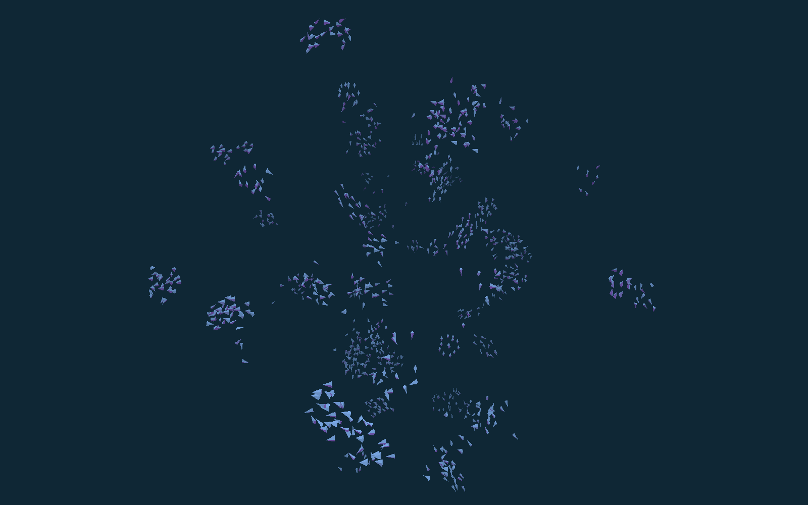

Flocking Simulation
===================

A 3D Boids-like flocking simulation coded in Haskell.

Bulding
-------

Assuming you have GHC 7.10 and stack installed, building the program should be as easy as running 'stack build'.

You can then run the simulation with the command 'stack exec boids'.

Demo and Screenshots
--------------------

[Here is a video demonstrating a typical run with the default configuration.](https://youtu.be/jn4hNzcmsZU)

This is just after starting the program, when the boids are beginning to organize into groups.

After running for a while, much larger groups of boids form.

Usage
-----

The controls are very simple:

    * Click and drag with the mouse to move the camera around.
    * Use the 'w' and 's' keys to zoom in and out.
    * Quit the application by pressing 'q', the escape key, or closing the window.

Details
-------

As stated above, the entire program is written in Haskell in a purely functional style. To do 3D rendering, I use the newly released [GPipe 2](https://hackage.haskell.org/package/GPipe-2.1.4) library which creates a type safe way to interface with OpenGL 3.3. GPipe also provides a DSL for writing shaders, so all the shader code is written in Haskell as well.

The main data structure used to keep track of and efficiently update the boids is an octree. Every frame, the octree is flattened to a list and each boid is updated. This action is performed in parallel using all available CPU cores. The list of updated boids is then used to build a new octree (also in parallel), and the boids are rendered. I suspect that there's a lot of room for efficiency improvements by switching the lists in this process to vectors. That change would also (I think) allow me to utilize the Repa library and push boid updating to the GPU, potentially resulting in an enormous increase in the number of boids I'm able to simulate.

TODO List
---------

Here are some things I'd like to improve (in no particular order):

    * Replace lists with vectors
    * Add predators and prey
    * Integrate with the Repa library to exploit GPU parallelization
    * Add a GUI and allow customizable parameters on the fly
    * Add more sophisticated boid behavior
    * Optimizations!
